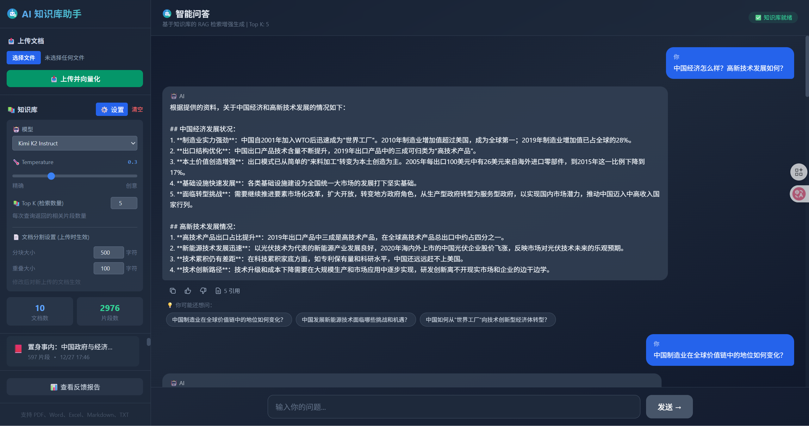

# AI 知识库助手

基于 RAG（检索增强生成）的智能知识库问答系统，支持多种文档格式上传和多个大语言模型。




## ✨ 功能特性

### 📚 知识库管理
- **多格式支持**：PDF、Word (.docx)、Excel (.xlsx/.xls)、Markdown (.md)、TXT
- **智能分割**：自动将文档分割成合适大小的片段
- **向量存储**：使用阿里云 DashScope 文本嵌入模型进行向量化
- **文档管理**：支持查看、删除单个文档或清空知识库

### 🤖 智能问答
- **RAG 检索增强**：基于知识库内容回答问题，避免幻觉
- **多模型支持**：
  - DeepSeek R1 / V3
  - Qwen3 Max / Qwen Max / Qwen Plus / Qwen Turbo / Qwen Long
  - GLM 4.5 / 4.6
  - Kimi K2 Thinking / Instruct
- **引用展示**：显示回答所引用的文档片段
- **推荐问题**：AI 自动生成相关的后续问题

### 📊 反馈系统
- **点赞/点踩**：对回答质量进行评价
- **反馈报告**：统计满意率、热门问题、差评分析
- **数据导出**：导出 CSV 格式，可用于模型微调

### ⚙️ 可配置参数
- **模型选择**：支持多种大语言模型切换
- **Temperature**：调整回答的创意程度 (0-1)
- **Top K**：检索返回的相关片段数量 (1-20)
- **分块大小**：文档分割的块大小 (100-2000 字符)
- **重叠大小**：相邻片段的重叠部分 (0-500 字符)

## 🚀 快速开始

### 环境要求
- Node.js 18+
- npm 或 yarn

### 安装步骤

1. **克隆项目**
```bash
git clone https://github.com/your-username/ai-rag-starter.git
cd ai-rag-starter
```

2. **安装依赖**
```bash
npm install --legacy-peer-deps
```

3. **配置环境变量**
```bash
cp .env.example .env.local
```

编辑 `.env.local` 文件，填入你的阿里云 DashScope API Key：
```env
DASHSCOPE_API_KEY=your_dashscope_api_key_here
```

4. **启动开发服务器**
```bash
npm run dev
```

5. **访问应用**

打开浏览器访问 http://localhost:3000

## 📁 项目结构

```
ai-rag-starter/
├── src/
│   ├── app/
│   │   ├── api/
│   │   │   ├── chat/           # 聊天 API
│   │   │   ├── upload/         # 文件上传 API
│   │   │   ├── knowledge/      # 知识库管理 API
│   │   │   ├── feedback/       # 反馈系统 API
│   │   │   └── reindex/        # 重建索引 API
│   │   ├── page.tsx            # 主页面
│   │   ├── layout.tsx          # 布局
│   │   └── globals.css         # 全局样式
│   ├── lib/
│   │   ├── llm.ts              # 大语言模型封装
│   │   ├── embeddings.ts       # 文本嵌入模型
│   │   ├── vector-store.ts     # 向量存储管理
│   │   └── rag.ts              # RAG 检索逻辑
│   └── types/
│       └── modules.d.ts        # 类型声明
├── public/
│   └── favicon.svg             # 网站图标
├── uploads/                    # 上传文件存储目录
├── data/                       # 反馈数据存储目录
├── .env.example                # 环境变量示例
├── package.json
├── tsconfig.json
├── tailwind.config.js
└── README.md
```

## 🔧 技术栈

- **前端框架**：Next.js 14 (App Router)
- **编程语言**：TypeScript
- **样式方案**：Tailwind CSS
- **AI 框架**：LangChain
- **向量存储**：MemoryVectorStore（内存存储）
- **文本嵌入**：阿里云 DashScope text-embedding-v3
- **大语言模型**：阿里云 DashScope API（支持多种模型）
- **文档解析**：
  - PDF: pdf-parse
  - Word: mammoth
  - Excel: xlsx

## 📝 使用说明

### 上传文档
1. 点击左侧「选择文件」按钮
2. 选择支持的文档格式（PDF/Word/Excel/Markdown/TXT）
3. 点击「上传并向量化」
4. 等待处理完成

### 提问
1. 在右侧输入框输入问题
2. 点击「发送」或按回车
3. 查看 AI 回答和引用片段
4. 点击推荐问题继续探索

### 调整设置
1. 点击「⚙️ 设置」按钮
2. 选择模型、调整 Temperature 等参数
3. 设置会立即生效

### 重建索引
如果重启服务后文档丢失：
1. 确保 `uploads` 目录中有文档
2. 点击「🔄 重建 uploads 目录索引」
3. 等待重新向量化完成

## ⚠️ 注意事项

1. **内存存储**：当前使用内存向量存储，重启服务后向量数据会丢失。可通过「重建索引」功能恢复。

2. **API 配额**：
   - 文档向量化和问答都会消耗 DashScope API 配额
   - 部分模型（如 Qwen3-max）免费额度有限

3. **模型限制**：
   - GLM-4.5/4.6、DeepSeek-R1 只支持流式模式（已自动处理）
   - Qwen3 系列需要特殊参数（已自动处理）

## 🔮 后续计划

- [ ] 支持持久化向量数据库（Milvus/Pinecone）
- [ ] 支持更多文档格式（PPT、图片 OCR）
- [ ] 支持对话历史记忆
- [ ] 支持多轮对话上下文
- [ ] 添加用户认证系统
- [ ] 支持 Docker 一键部署

## 📄 License

MIT License

## 🤝 贡献

欢迎提交 Issue 和 Pull Request！

---

Made with ❤️ by HuangYunfa

